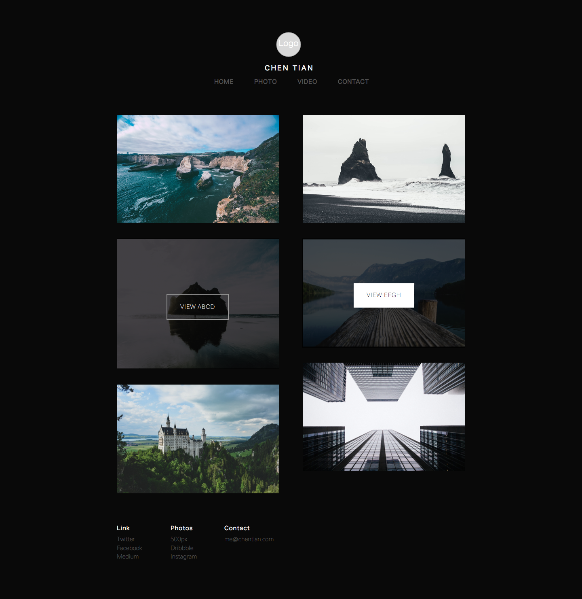

# sketch-learning

Learning to use Sketch by practice.

### 0x09 Personal Site

### 0x08 Day

#### Implement

- Read [Mastering the Bézier Curve in Sketch](https://medium.com/sketch-app/mastering-the-bezier-curve-in-sketch-4da8fdf0dbbb)
- Draw Twitter Icon with Bezier Curve and Imitate the [Horizontal & Vertical Bezier](http://theagsc.com/community/tutorials/so-whats-the-big-deal-with-horizontal-vertical-bezier-handles-anyway)

#### Note

- Hold `Shift` when dragging out your handles to snap them horizontally & vertically.

#### Result

---------

### 0x07 Day

#### Implement

- [How to create a flat styled icon in Sketch 3](https://medium.com/@sokratus/how-to-create-a-flat-styled-icon-in-sketch-3-27c4bd09989)

#### Note

- How to customize and combine basic shapes into illustrations  *more:* [Harnessing Vector Awesomeness in Sketch](https://medium.com/sketch-app/harnessing-vector-awesomeness-in-sketch-3c9621408138)

#### Result

-----

### 0x06 Day

##### Implement

- Imitate [Google Trend](https://www.google.com/trends/2014/)

##### Note

- Download popularity typeface from [Google Fonts](http://www.google.com/fonts)
- Read [Thinking with Type](http://www.thinkingwithtype.com/contents/letter/)
- Same font can be apply in different size UI.

##### Result

Following is the imitation UI for desktop HD and you can find the mobile in `0x06_Google_Trend` folder.

-----

### 0x05 Day

##### Implement

- Imitate [Twitter lite](http://sgabriel.dunked.com/twitter-lite)
- [Twitter Lite Part.2](https://dribbble.com/shots/1448949-Twitter-Lite-Part2/attachments/214121) - by Sebastien Gabriel

##### Note

- Discover the Sketch Plugins features.   *more:* [Sketch Toolbox](http://sketchtoolbox.com/) [Awesome Sketch Plugins](http://awesome-sket.ch/)
- Get plenty of Sketch free resources in [Sketch APP Sources](http://www.sketchappsources.com/), such as iPhone Wireframe or cute icon.
- Use **Shared style** to keep the style of multiple layers the same.

##### Result

-----

### 0x04 Day

##### Implement

[Experimenting With Colors And Concepts](http://blog.mengto.com/experimenting-colors-concepts/)

##### Note

- Meng To’s design blog is valuable and worthy to read.
- From [Experimenting With Colors And Concepts](http://blog.mengto.com/experimenting-colors-concepts/), I studied how to "steal" others' color inspiration.
- The **Make Grid** feature can help you create a series of squares quickly.
- How to export different size pic.

##### Result

-----

### 0x03 Day

##### Implement

[Sketch Tutorial_01 Colorful switch](https://medium.com/google-design/sketch-tutorial_01-b76271a095e3)

##### Note

- To create shadows is so complex...
- The Sketch with built-in many useful templates.
- Learn some Sketch Shortcuts.    *more:* [Sketch Shortcuts](http://sketchshortcuts.com/)

##### Result

-----

### 0x02 Day

##### Implement

[How to Create a Website Header Design Using Bohemian Coding Sketch](http://medialoot.com/blog/how-to-create-a-website-header-design-using-bohemian-coding-sketch/)

##### Note

- How to add background.
- **Edit** the simple shape.

##### Result

-----

### 0x01 Day

##### Implement

[Sketch for Beginners: Design a Login Form Interface](http://webdesign.tutsplus.com/tutorials/sketch-for-beginners-design-a-login-form-interface--cms-21534)

##### Note

- Familiar with the sketch basic operation. 
- How to organize the group.
- Don't understand boolean operation like Substract.
- [Free (do whatever you want) high-resolution photos](https://unsplash.com/)

##### Result

